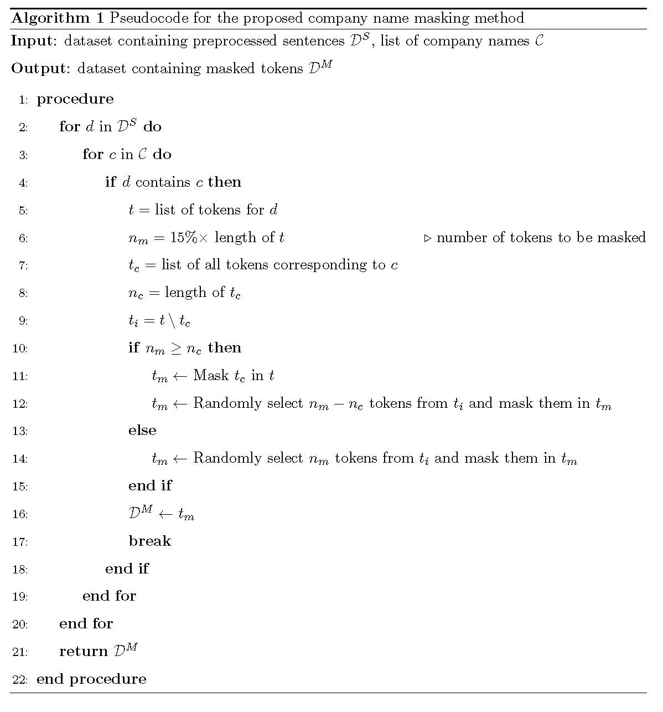

# Incorporation of Company-Related Factual Knowledge into Pretrained Language Models for Stock-Related Spam Tweet Filtering

## Citation
```
In preparation
```

### Pseudocode


## Environment 
### `conda` environment
```bash
conda create --name transformers python=3.7
conda activate transformers
conda install pytorch torchvision torchaudio pytorch-cuda=11.7 -c pytorch -c nvidia 
pip install transformers scikit-learn pandas tqdm matplotlib seaborn ipython nltk
```

### using `pip`
```bash
pip3 install torch torchvision torchaudio
pip install transformers scikit-learn pandas tqdm matplotlib seaborn ipython nltk
```

## Base models
* SEC-BERT
	- This repository uses `SECBERT` as an alias for this model.
	- Loukas, L., Fergadiotis, M., Chalkidis, I., Spyropoulou, E., Malakasiotis, P., Androutsopoulos, I., & Paliouras, G. (2022). FiNER: Financial numeric entity recognition for XBRL tagging. In Proceedings of the 60th Annual Meeting of the Association for Computational Linguistics (Volume 1) (pp. 4419–4431).
	- [https://huggingface.co/nlpaueb/sec-bert-base](https://huggingface.co/nlpaueb/sec-bert-base)

* Huang et al.'s FinBERT
	- This repository uses `Yang` as an alias for this model.
	- Huang, A. H., Wang, H., & Yang, Y. (2022). FinBERT: A large language model for extracting information from financial text. Contemporary Accounting Research, 00 , 1–36.
	- Yang, Y., UY, M. C. S., & Huang, A. (2020). Finbert: A pretrained language model for financial communications. arXiv:2006.08097.
	- [https://github.com/yya518/FinBERT](https://github.com/yya518/FinBERT)
	- [https://huggingface.co/yiyanghkust/finbert-pretrain](https://huggingface.co/yiyanghkust/finbert-pretrain)

* Araci's FinBERT
	- This repository uses `Araci` as an alias for this model.
	- [https://github.com/ProsusAI/finBERT](https://github.com/ProsusAI/finBERT)
	- [https://huggingface.co/ProsusAI/finbert](https://huggingface.co/ProsusAI/finbert)

* BERT
	- This repository uses `BERT` as an alias for this model.
	- [https://huggingface.co/bert-base-uncased](https://huggingface.co/bert-base-uncased)

## Dataset for post-training (Form 10-Ks)

### Python packages
You can download the Item 1 sections used in the experiment [here](https://github.com/sophia-jihye/Incorporation_of_Company-related_Factual_Knowledge_into_Pretrained_Language_Models/tree/main/SEC-API.io).
- The dataset contains the Item 1 section of the 10-K filings published in 2016. No other years are included.
- We used <a href="https://sec-api.io">SEC-API.io</a> to scrape Form 10-Ks and extract item 1 sections.


## Dataset for fine-tuning (Tweet dataset) 
* Cresci, S., Lillo, F., Regoli, D., Tardelli, S., & Tesconi, M. (2019). Cashtag Piggybacking: Uncovering Spam and Bot Activity in Stock Microblogs on Twitter. ACM Transactions on the Web (TWEB), 13(2), 11.
* [Cresci et al. (2019) dataset](https://zenodo.org/record/2686862#.Yi2D4nrP23A)
